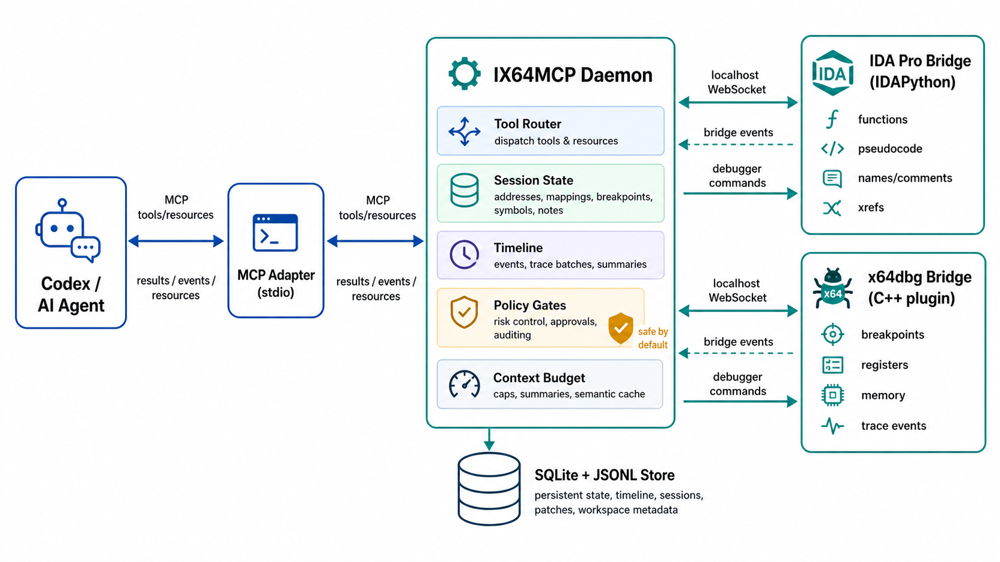

# IX64MCP

**IDA + x64dbg MCP for AI-assisted reverse engineering.**

IX64MCP connects an AI agent such as Codex to a live reverse-engineering workspace: IDA Pro for static analysis, x64dbg for dynamic analysis, and a local MCP daemon that keeps addresses, breakpoints, comments, traces, notes, patch plans, and reports in one session.

This is an **alpha research/developer tool**, not a polished commercial product. The current goal is to make AI-assisted reversing practical, observable, and safe by default.

## Why This Exists

Most reverse-engineering integrations expose one tool at a time: an IDA helper, a debugger helper, or a script that dumps context. IX64MCP is built around a stronger idea:

> Let the AI agent coordinate static analysis, live debugging, patch planning, and reporting through one local session model.

That means the agent can answer questions like:

- "Explain the function where the debugger stopped."
- "Find likely password checks."
- "Break on entry and map the runtime address back to IDA."
- "Summarize calls, strings, imports, branches, and pseudocode."
- "Read registers and stack at a breakpoint."
- "Create rename/comment suggestions instead of silently modifying the database."
- "Generate a compact malware-analysis report from timeline, triage, IoCs, and patch candidates."

## Architecture



IX64MCP is intentionally local-first:

- Codex talks to a thin MCP adapter over stdio.
- The adapter proxies tools/resources to the IX64MCP daemon.
- IDA and x64dbg connect to the daemon over `127.0.0.1` WebSocket bridges.
- The daemon owns session state, mappings, policy gates, timeline summaries, and persistent storage.
- SQLite + JSONL keep sessions, events, suggestions, mappings, breakpoints, patch reports, and workspace metadata.

## Current Status

IX64MCP is a **serious alpha prototype**.

What works today:

- MCP daemon + thin Codex adapter split.
- IDAPython bridge for IDA Pro 9.1.
- x64dbg x64 C++ plugin bridge.
- Live current-address sync and runtime/static mapping.
- Breakpoints, stepping, register reads, memory reads, memory maps, call stacks, threads, exceptions.
- IDA functions, xrefs, strings, pseudocode chunks, callgraph/CFG helpers, comments, rename suggestions.
- Timeline, summaries, semantic cache, context budget profiles.
- Safe patch planning and gated file patching with backup/diff/rollback.
- Malware sample workspace, triage, IoCs, configs, lineage, behavior report, JSON/Markdown/HTML export.
- Bounded runtime workflows such as `workflow.analyze_function_runtime`.
- 100 automated tests covering server behavior, sync edges, policy, persistence, installation surface, and workflow orchestration.

Known alpha limitations:

- Windows-first.
- x64dbg x64 first; x32 support is not the main path yet.
- The project is single-live-session oriented.
- IDA/x64dbg bridges must be installed manually or through helper scripts.
- The x64dbg plugin binary should be downloaded from GitHub Releases for normal users.
- Protocol/schema hardening is still a roadmap item.

## Fast Install

### Requirements

- Windows 10/11 x64
- Python 3.14+ or `uv`
- IDA Pro 9.1 with IDAPython
- x64dbg x64
- Codex desktop/CLI with MCP config support
- `ix64mcp.dp64` from the latest GitHub Release

### 1. Clone

```powershell
git clone https://github.com/lowcort1sol/ida-x64dbg-mcp.git
cd ida-x64dbg-mcp
```

### 2. Download the x64dbg Plugin

Download `ix64mcp.dp64` from the latest GitHub Release.

Normal users should use the release binary. Building the x64dbg plugin locally is a developer path.

### 3. Run the Installer

```powershell
.\scripts\install.ps1 `
  -IdaPluginsDir "C:\Path\To\IDA Pro 9.1\plugins" `
  -X64DbgPluginsDir "C:\Path\To\x64dbg\release\x64\plugins" `
  -X64DbgPluginBinary "C:\Path\To\ix64mcp.dp64"
```

Minimal server-only setup:

```powershell
.\scripts\install.ps1
```

The installer:

- creates or reuses `.venv`;
- installs `ix64mcp` into the virtual environment;
- creates `state/` and `state/logs/`;
- optionally copies the IDA plugin;
- optionally copies the x64dbg plugin;
- prints a ready-to-paste Codex MCP config.

It does **not** edit your Codex config automatically.

### 4. Configure Codex

The installer prints a snippet like this:

```toml
[mcp_servers.ix64mcp]
command = "C:\\path\\to\\IX64MCP\\.venv\\Scripts\\python.exe"
args = ["-m", "ix64mcp.server", "mcp"]
```

Paste it into your Codex MCP config, then restart or refresh Codex.

### 5. Start and Verify

```powershell
.\.venv\Scripts\python -m ix64mcp.server start
.\scripts\doctor.ps1
```

After opening IDA and x64dbg, `doctor` should report:

```text
daemon_health.ok = true
connected.ida = true
connected.x64dbg = true
```

## What You Can Do

### Static Analysis Through IDA

The agent can ask IDA for:

- function boundaries and chunks;
- xrefs;
- strings and string xrefs;
- compact function summaries;
- pseudocode chunks;
- callgraph and CFG slices;
- callers/callees;
- import-to-caller and string-to-function flows;
- branch context and stack variable usage;
- safe rename/comment/decompiler-comment suggestions.

Useful calls:

```text
ida.function_summary
ida.pseudocode
ida.callgraph
ida.cfg
ida.string_to_functions
analysis.suggest_name
analysis.suggest_comment
analysis.apply_suggestion
```

### Dynamic Analysis Through x64dbg

The agent can ask x64dbg for:

- current registers;
- memory reads;
- memory map;
- threads;
- call stack;
- exceptions;
- software/hardware/memory/conditional breakpoints;
- breakpoint snapshots;
- safe dump metadata;
- compact trace recipe events.

Useful calls:

```text
x64dbg.read_registers
x64dbg.read_memory
x64dbg.memory_map
x64dbg.call_stack
x64dbg.breakpoint_snapshot
x64dbg.run_until_breakpoint
trace.recipe_enable
```

### Agent Workflows

High-level workflows combine multiple low-level tools:

```text
workflow.follow_debugger
workflow.explain_current_function
workflow.find_password_check
workflow.break_on_first_strcmp_like
workflow.rename_functions_from_trace
workflow.make_patch_plan
workflow.generate_analysis_report
workflow.analyze_function_runtime
```

Example: `workflow.analyze_function_runtime` maps an IDA EA to runtime, sets a breakpoint, runs with a required timeout, waits for the exact hit, collects registers/stack/memory/call stack, writes an IDA comment, and returns a compact report.

### Patch/Crackme Assistance

IX64MCP supports preview-first patch work:

- `patch.plan` scans for compare/JCC and success/failure string patterns.
- `patch.apply_file` is policy-gated.
- patched files get backups and hash logs.
- `patch.diff` reports byte-level differences.
- `patch.rollback` restores from backup.

Memory patching is intentionally not enabled by default.

### Malware Analysis Workspace

The malware workspace keeps case data together:

- sample copy and hashes;
- IDB/debugger paths;
- sandbox metadata;
- notes;
- IoCs;
- extracted configs;
- artifacts;
- lineage;
- tags/status;
- behavior reports;
- JSON/Markdown/HTML exports.

Useful calls:

```text
malware.workspace_create
malware.triage
malware.add_ioc
malware.add_config
malware.add_artifact
malware.add_lineage
malware.behavior_report
malware.export_report
```

## Context Budget

Reverse engineering can generate too much data for an AI context window. IX64MCP avoids dumping everything by default.

It provides:

- `quick`, `compact`, `deep`, and `forensic` response profiles;
- capped timeline summaries;
- semantic cache;
- compact report resources;
- pseudocode chunking;
- capped trace batches.

Useful resources:

```text
analysis://current
analysis://modules
analysis://functions/hot
analysis://patches
analysis://report
analysis://runtime-history
analysis://correlation
malware://workspace
malware://behavior-report
```

## Safety Model

Default mode is `analysis-safe`.

Allowed by default:

- navigation;
- reads;
- comments;
- names;
- breakpoints;
- stepping;
- bounded runtime workflows;
- patch planning;
- safe dump metadata.

Gated or blocked by default:

- memory patching;
- raw process memory dumping;
- file patch application;
- long autonomous run loops;
- dangerous malware automation.

Every mutating action is logged to the timeline.

Optional bridge token:

```powershell
$env:IX64MCP_TOKEN = "change-me-local-secret"
```

Set the same token before launching the daemon, IDA, and x64dbg if you want localhost bridge authentication.

## Server Commands

```powershell
.\.venv\Scripts\python -m ix64mcp.server start
.\.venv\Scripts\python -m ix64mcp.server stop
.\.venv\Scripts\python -m ix64mcp.server status
.\.venv\Scripts\python -m ix64mcp.server doctor
.\.venv\Scripts\python -m ix64mcp.server mcp
```

Process model:

- `start` / `daemon`: owns bridge port `127.0.0.1:8765` and daemon API `127.0.0.1:8766`;
- `mcp`: thin Codex adapter, no bridge port binding;
- `legacy`: old combined stdio+bridge mode for debugging only.

Default logs:

```text
state/logs/daemon.log
state/logs/mcp.log
```

## Troubleshooting

### Codex lists tools, but tool calls fail

Run:

```powershell
.\scripts\doctor.ps1
```

If the daemon is down:

```powershell
.\.venv\Scripts\python -m ix64mcp.server start
```

### Stale or partial server

```powershell
.\.venv\Scripts\python -m ix64mcp.server stop --force
.\.venv\Scripts\python -m ix64mcp.server start
```

### IDA is disconnected

- Verify `ix64mcp_ida.py` is in the IDA `plugins` directory.
- Restart IDA after copying the plugin.
- Make sure the daemon is already running.

### x64dbg is disconnected

- Verify `ix64mcp.dp64` is in `x64dbg\release\x64\plugins`.
- Restart x64dbg after copying the plugin.
- Make sure the daemon is already running.

### IDAPython does not load

IDA may need a configured Python runtime. Run IDA's `idapyswitch` and choose a compatible Python install.

## Developer Setup

Install development dependencies:

```powershell
uv python install 3.14.4
uv venv --python 3.14.4 .venv
uv pip install --python .\.venv\Scripts\python.exe -e ".[dev]"
```

Run tests:

```powershell
.\.venv\Scripts\python -m pytest
.\.venv\Scripts\python -m compileall ix64mcp bridges tests
```

Build the x64dbg bridge from source:

```powershell
.\scripts\build-x64dbg-plugin.ps1
```

Run local bridge simulators without IDA/x64dbg:

```powershell
.\.venv\Scripts\python -m ix64mcp.harness --role ida
.\.venv\Scripts\python -m ix64mcp.harness --role x64dbg
```

Run the x64dbg smoke test:

```powershell
.\.venv\Scripts\python -m ix64mcp.smoke_x64dbg --kill --timeout 30 --event-timeout 10
```

## Samples

The `samples/` tree contains small benign binaries for testing workflows:

- `crackme_simple`: password-checking practice target;
- `anti_debug_demo`: debugger-detection examples;
- `control_flow_lab`: branch-heavy control-flow practice target.

Build them with:

```powershell
cmake -S samples -B build/samples -G Ninja
cmake --build build/samples
```

## Repository Layout

```text
ix64mcp/                  Python daemon, MCP adapter, workflows, policy, storage
bridges/ida/              IDAPython bridge plugin
bridges/x64dbg/           x64dbg C++ bridge plugin source
scripts/                  installation, doctor, and build helpers
samples/                  benign test binaries
tests/                    automated regression and hardening tests
docs/assets/              README images and public assets
pluginsdk/                x64dbg plugin SDK headers/libs
```

## GitHub Alpha Notes

This project is intentionally public-alpha:

- APIs may change.
- Protocol hardening is ongoing.
- Long malware sessions need more live testing.
- Contributions should prefer reliability, session correctness, protocol schemas, and demo polish over adding many new tools.

The high-level direction is stable: **one local MCP platform where AI agents can coordinate IDA, x64dbg, timeline, patch planning, and malware-analysis reporting without drowning in raw context.**
